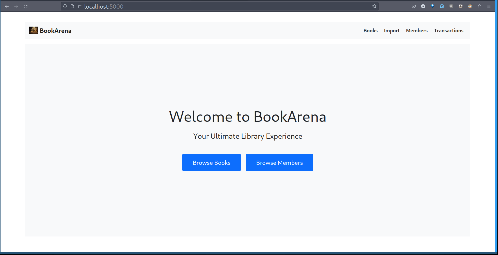
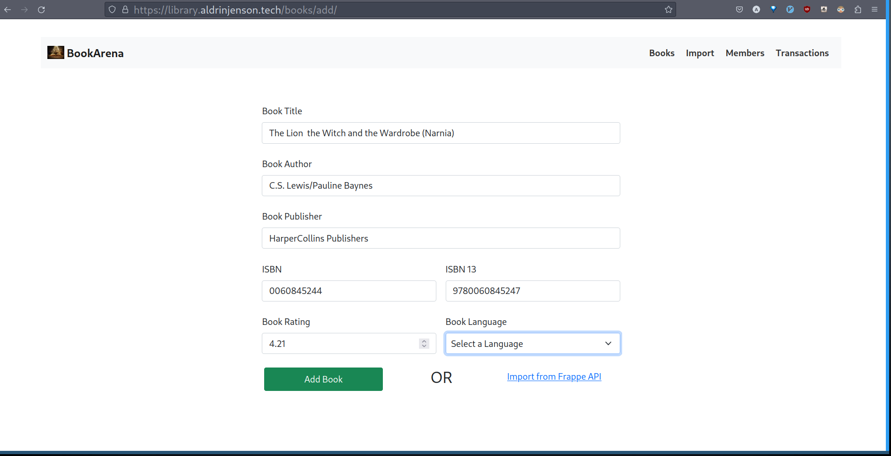
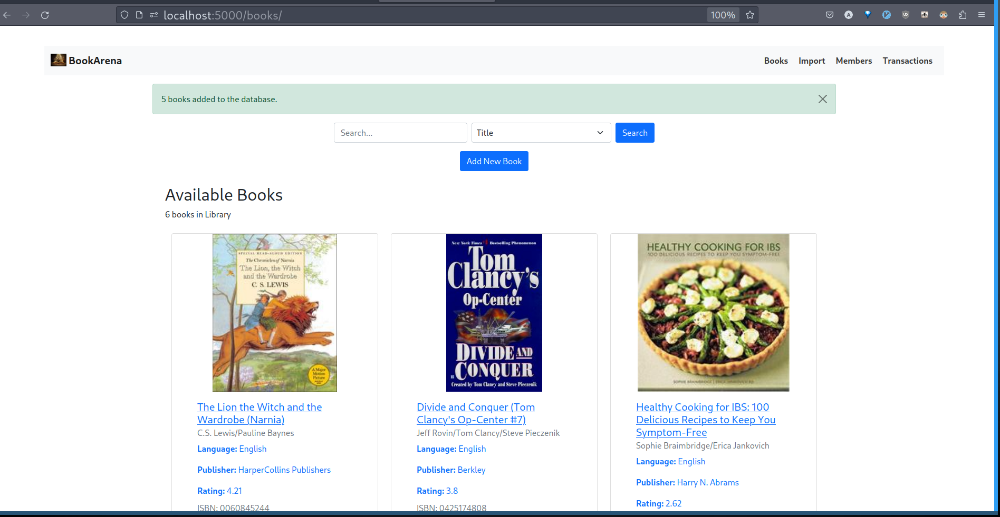
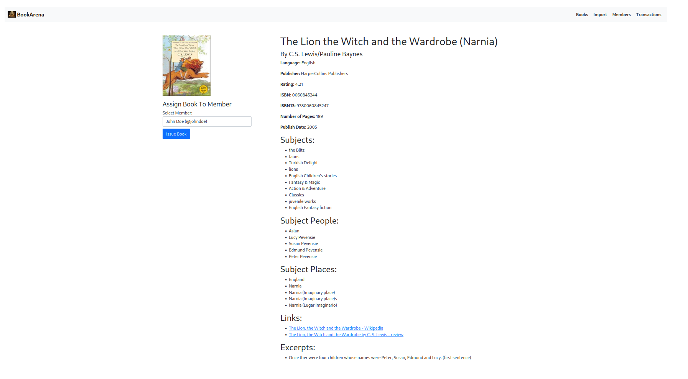
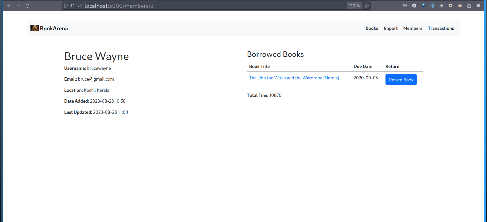
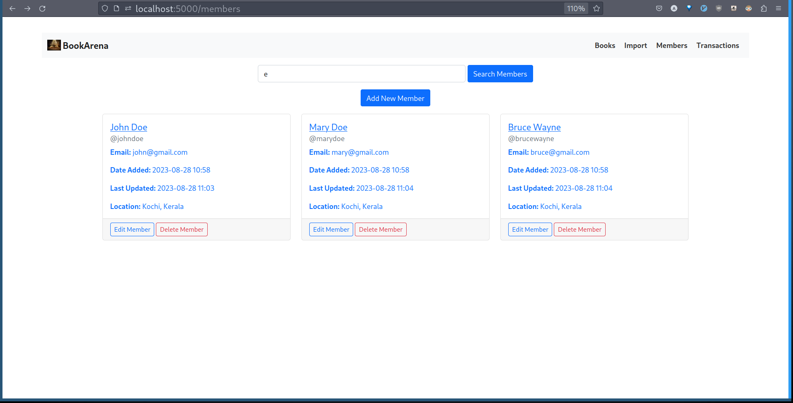
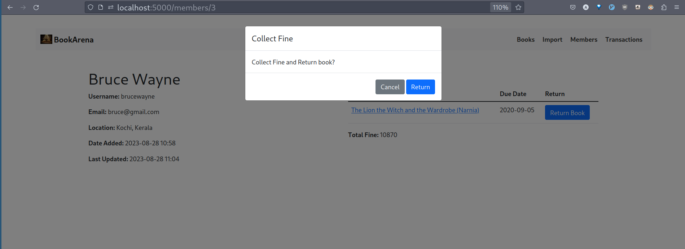
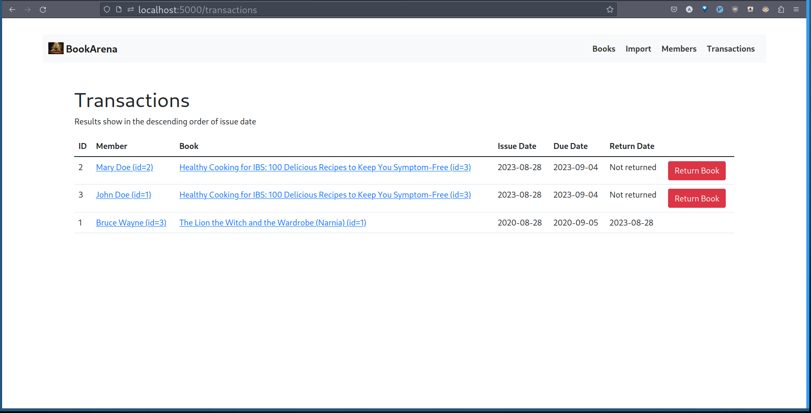
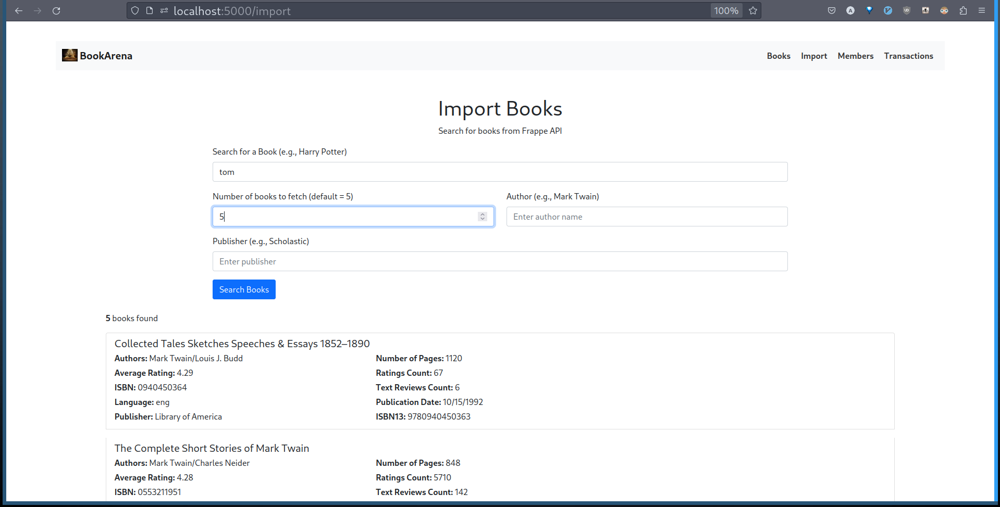

# BookArena Library Management System

BookArena is a web-based library management system that allows you to manage books, members, transactions, and fines efficiently. This project was built using Flask, SQLAlchemy, and Bootstrap.

## Features

- Add, edit, and delete books from the library.
- Add, edit, and delete members.
- Manage book transactions and due dates.
- Ability to import books from Frappe API based on filters
- Calculate fines for overdue books.
- User-friendly interface.
- Simple and minimal stylings with BootstrapCSS

### Extra

- prevent one user from taking the same book multiple times
- prevents one user having a fine more than 500 rs to take a book
- fetches extra book details from openlibrary API
  - subjects
  - subject_people
  - subject_places
  - links
  - ebooks
  - excerpts

# Screenshots

Here are some screenshots of BookArena in action:











## Getting Started

1. Clone the repository:

   ```sh
   git clone https://github.com/aldrinjenson/bookarena.git
   ```

2. Install dependencies:

```sh
pip install -r requirements.txt
```

3. Set up sqlite db and tweak environment variables.

```sh
cp .env.sample .env
```

4. Modify constants in app/constants.py
   Default values are the following:

```python
API_LIMIT = 20
BORROW_DURATION = 7  # in days
FINE_PER_DAY = 1
```

5. Run the application:

```sh
flask run
```

6. Access the application at http://localhost:5000.

## Usage

- Browse books and members.
- Add&Edit books and members
- Borrow and return books.
- Import books from Frappe API
- Check fines for overdue books from users.
- Resolve fines by collecting money

## Contributing

Contributions are welcome! Please feel free to open issues and submit pull requests.
